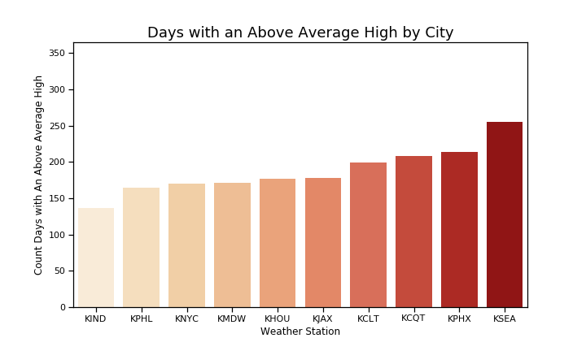
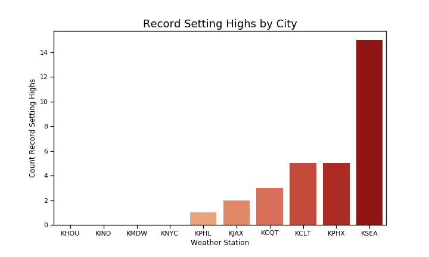
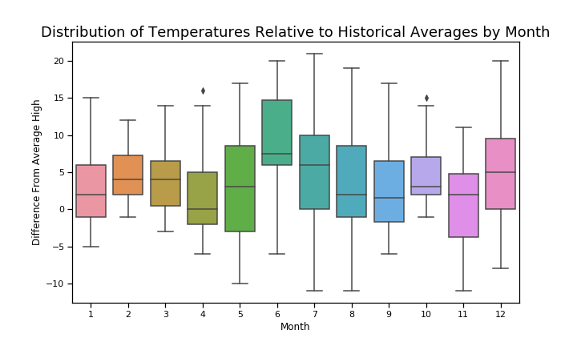

# Weather Data Analysis

Weather data pulled from the [fivethirtyeight data repo](https://github.com/fivethirtyeight/data/tree/master/us-weather-history). This data was originally scraped from Weather Underground. The dataset contains a year's worth of weather data starting from July 2014 for Charlotte, Los Angeles, Houston, Indiannapolis, Jacksonville, Chicago, New York, Philadelphia, Pheonix, and Seattle.

This analysis also uses Chicago L ridership data from the [Chicago Data Portal](https://data.cityofchicago.org/Transportation/CTA-Ridership-L-Station-Entries-Daily-Totals/5neh-572f).

Code for generating plots can be found in GeneratePlots.ipynb

---

A count of days where the high temperature was greater than the historical average high temperature for that day reveals that Seattle had an especially hot year, whereas Indiannapolis had a relatively cool year.

A count of days where a record high was set confirms that Seattle really did have an especially hot year. 15 record highs, going back to 1880, were set in this year alone!

For Seattle, distributions of temperature relative to historical averages show that June, July, and December were the relative hottest months in this sample.

Counting the number of days with snow (average temperature less than 32 degrees and some amount of precipitation) reveals that Indiannapolis had 22 snow days.

For the final analysis the Chicago weather data was joined to the L ridership data. Overlaying system-wide daily ridership with temperature reveals a weak association between temperature and number of subway riders. The correlation coefficient between these two measures was found to be 0.136, which confirms this weak association. Interestingly a large drop in ridership can be seen for the weeks of Thanksgiving, Christmas, and New Year's Day.

Lastly, ridership on rainy days (days with over 0.1 inches of precipitation) was compared to non-rainy days. The data suggests a very weak association between ridership and rainy days, with averages of 536K riders on non-rainy days and 529K riders on rainy days. A Z-test comparing daily riders on rainy vs non-rainy days fails to reject the null hypothesis, the null hypothesis being that ridership is unaffected by rain. The P-value determined by this Z-test was 0.73, demonstrating that rain is a fairly insignificant factor for determining ridership. However, it's possible that by setting a much higher threshold for what is considered a "rainy" day (for example 1 inch vs 0.1 inch) that the null hypothesis could be rejected.